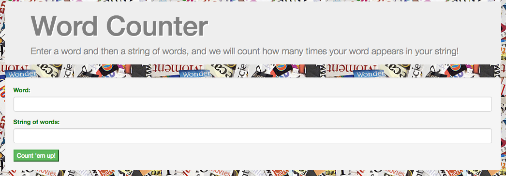
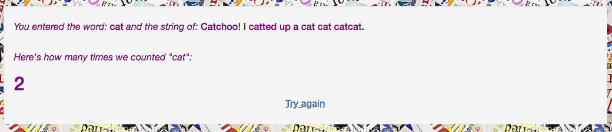

# Word Frequency
##### _Behavior-Driven Development PHP Independent Project for Epicodus, July 7, 2017_

#### By _Calla Rudolph_ [(e-mail me here)](<mailto:callarudolph@gmail.com>)

## Description

This web application allows users to input a single word and a string of words, and the program will check for how frequently the given word appears in the given string. This is a practice in using Behavior-Driven Development in PHP with the Silex micro framework and twig templates. It was tested step by step using the PHPUnit testing framework.


_This image is a screenshot of the search form_


_This image is a screenshot of the results page_

## Setup

* Open GitHub site on your browser: https://github.com/CallaRudolph/Word-Frequency
* Select the dropdown (green box) "Clone or download"
* Copy the link for the GitHub repository
* Open Terminal on your computer and perform the following steps:
````
    * $ cd desktop
    * $ git clone <paste repository link>
    * $ cd Word-Frequency
    * $ composer install
      (to download dependencies: Silex, Twig, and PHPUnit)
    * $ cd web
      (to access web folder)
    * $ php -S localhost:8000
      (to open local server)
````
* Open browser and type 'localhost:8000' to view app.
* Enter in a word and string of words, and find out how many times your word appears in the string!
* Click "Try again" to return to the home page.

## Specifications
* The program should allow the user to enter a single-word base input and a second single-word input, compare if they match, and return that either one match was found or no matches were found.
	* Input: ‘cd’ (base input); ‘cd’ (second input) — _testing for successful multi-character match_
	* Output: 1
* The program should allow the user to enter a single-word base input and a string of at least two words for second input, compare the base input to the entire string, and return the number of matches found.
	* Input: ‘be’ (base input); ‘bee is be’ (second input) — _testing that the program can compare a single-word base input string to a multi-word second input string and find the exact word match_
	* Output: 1
* The program should allow the user to enter a single-word base input, and a multi-word string second input, and return the number of matches found, regardless of case.
	* Input: ‘Bird’ (base input); ‘birD is the word’ (second input) — _testing for successful conversion of inputs to lowercase letters for proper comparison_
	* Output: 1
* The program should produce an error message if more than one word is entered for the base input.
	* Input: ‘mad cat’ (base input); ’I have a mad cat’ (second input) — _testing that the program recognizes a space in the base input_
	* Output: "Hold up... we said enter a SINGLE WORD to check against"
* The program should continue to check for matches even when the input string contains special characters.
	* Input: ‘won’ (base input); ’I won!' (second input) — _testing that the program can find a special character in the second input_
	* Output: "1"

## Technologies Used

PHP, Silex, Twig, PHPUnit, CSS, HTML5

### License
This software is licensed under the MIT license.

Copyright &copy; 2017 **_Calla Rudolph_**
